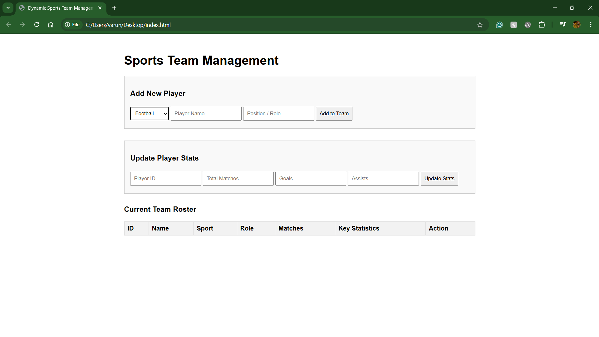

# Dynamic Sports Team Management System

## Overview
This is a Full-Stack CRUD (Create, Read, Update, Delete) application designed to manage a sports team roster. The system features a dynamic user interface that adapts statistical tracking based on the selected sport (e.g., tracking "Goals" for Football, but "Runs" for Cricket).

## Technology Stack
* **Frontend:** HTML5, CSS3, Vanilla JavaScript, Fetch API
* **Backend:** Java 17, Spring Boot, RESTful APIs
* **Database:** H2 In-Memory Database, Spring Data JPA

## Project Modules

### 1. Frontend Client Module
The user interface is a responsive, single-page application. It uses JavaScript to dynamically bind data and update DOM elements in real-time without reloading the page. It communicates with the backend asynchronously using the Fetch API.

### 2. Backend API Module
Built with Spring Boot, this module acts as the central controller. It exposes a REST API with endpoints for adding (`POST`), viewing (`GET`), updating (`PUT`), and removing (`DELETE`) player records. It handles Cross-Origin Resource Sharing (CORS) to securely connect with the client.

### 3. Database & Persistence Module
Utilizes an H2 In-Memory database mapped via Spring Data JPA. The data model dynamically stores agnostic statistics (`stat1`, `stat2`) to support multiple sports. It enforces data integrity by utilizing auto-incrementing primary keys for player IDs.

---

## Project Flow & Demonstration

### 1. Initial Dashboard
The clean user interface ready for data entry.

### 2. Dynamic Sport Selection
When the user changes the sport in the dropdown menu, the form instantly adapts to ask for the correct statistics.
*(Add screenshot2-dynamic.png here)*

### 3. Adding a Player (Create & Read)
Data is sent to the Java backend, saved in the database, and the roster table is instantly refreshed.
*(Add screenshot3-added.png here)*

### 4. Updating Player Stats (Update & Delete)
Users can update an existing player's lifetime statistics using their unique ID, or completely remove them from the database. 
*(Add screenshot4-updated.png here)*

---

## How to Run This Project
1. Ensure Java and Maven are installed on your machine.
2. Clone this repository.
3. Open the terminal in the root directory and run: `.\mvnw clean spring-boot:run`
4. Once the server starts on port 8080, open `index.html` in any web browser.
